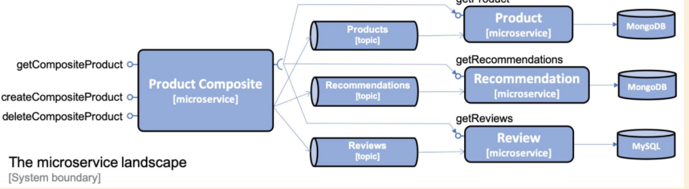

# Chapter 07 - Developing Reactive Microservices
Develop non-blocking synchronous REST APIs and asynchronous event-driven services using spring.

## Topics covered
- Choosing between non-blocking synchronous APIs and event-driven asynchronous services
- Developing non-blocking synchronous REST APIs using SPRING
- Developing event-driven asynchronous services
- Running manual tests of the reactive microservice landscape
- Running automated tests of the reactive microservice landscape

## Choosing between non-blocking synchronous APIs and event-driven asynchronous services
- minimize runtime dependencies = loose coupling
- asynchronous message passing of events, is preferable over synchronous APIs. 
This is because the microservices will only depend on access to the messaging system instead of being dependent on synchronous access to a number of other microservices.

### Cases where non-blocking synchronous APIs could be favorable to use:
- For read operations where an end user is waiting for a response
- Where the client platforms are more suitable for consuming synchronous APIs, for example, mobile apps or SPA web applications
- Where the clients will connect to the service from other organizations-where it might be hard to agree over a common messaging
system to use across organizations.

## For or system
- Create, read, delete (product composite) will be based on synchronous APIs. 
- The read services provided by the core microservices will also be non-blocking synchronous APIs since there is an end user waiting for their responses.
- The create and delete services provided by the core microservices will be developed as event-driven asynchronous services.
The synchronous APIs provided by the composite microservice to create and delete aggregate product information will simply publish
create and delete events on the topics that the core services listen on and then return with a 200 response

### Diagram


## An introduction to Spring Reactor
- Reactive support in Spring 5 is based on Project Reactor.
- Spring Reactor is fundamental and it is what Spring WebFlux, Spring WebClient and Spring Data rely on to provide their reactive
and non-blocking features.
- The programming model is based on processing streams of data, and the core data types in Project Reactor are
**Flux** and **Mono**
- A **Flux** object is used to process a stream of 0..n elements
- A **Mono** object is used to process 0..1 elements.

## Commands
```bash
curl localhost:8080/actuator/health -s | jq .
```
- run tests with default docker-compose
```bash
unset COMPOSE_FILE
./test-em-all.bash start stop
```
- RabbitMQ with two partitions
```bash
export COMPOSE_FILE=docker-compose-partitions.yml
./test-em-all.bash start stop
unset COMPOSE_FILE
```
- Kafka with two partitions
```bash
export COMPOSE_FILE=docker-compose-kafka.yml
./test-em-all.bash start stop
unset COMPOSE_FILE
```
