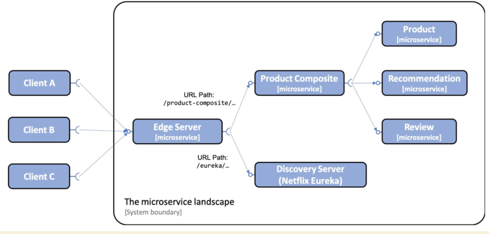

# Using Spring Cloud Gateway to Hide Microservices Behind an Edge Server

## Topics covered
- Adding an edge server to our system 
- Setting up a Spring Cloud Gateway, including configuring routing rules
- Trying out edge server



## Build & Run & Test

```bash
./gradlew clean build && docker-compose build
./test-em-all.bash start
```

## Check Routes Edge Server has set-up
```bash
curl localhost:8080/actuator/gateway/routes -s | jq '.[] | {"\(.route_id)": "\(.route_definition.predicates[0].args_genkey_0)"}'
```

